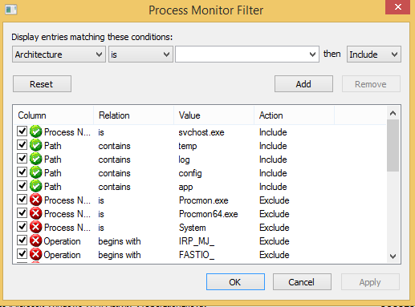

#Debug Process Monitor

花了大半天才解决的问题，有点low，但是第一次用Process Monitor debug成功解决问题，还是觉得很开心。

新接了一个web project。Dev machine setup完了以后成功build，结果发现site打不开。从IIS manager尝试启动site，直接抛出这样一个信息量稀少的提示：

这个问题很好google，因为world wide web publishing service（W3SVC）没有启动。尝试启动WSVC，失败！因为它depend on的service没有启动。它的dependency service是谁呢？Windows Process Activation Service(WAS)。启动WAS，可是无论是在service里面，还是以管理员身份运行的console里面，都是同样的error：Access Denied。

这个问题google出来的结果好几种，被一个说是端口80被别的服务占用的answer带到坑里去了。没有看到真正有用的建议就在[第三条](http://www.hanselman.com/blog/FixedWindowsProcessActivationServiceWASIsStoppingBecauseItEncounteredAnError.aspx)。

google <b>Windows Process Activation Service access denied</b> 得到的第三条result，并不是我遇到的问题，但是解决思路是一样的: Process Monitor。话说Process Monitor刚进公司第一个月就有前辈教过，但是我没放在心上。唉，简直是瞎。

按照link里的方法设置好filter以后。强调一下作者说的：filter对process monitor <b>很重要</b>：

这样一来，问题就很清楚了：

启动WAS要创建一个文件（空文件，不知道要做什么用）：bindingInfo.tmp。打开error中的目录下才发现，之所以Access Denied因为这个目录下已经存在了这样一个文件，也不知道什么时候做了什么创建的这个文件。Delete，重新启动。Done。

引用作者的一段话：

- Debugging is 95% tools and 5% intuition. Know what tools can get you that next bit of information you need to take the next step in your analysis.
- If you feel you've hit a wall in your analysis, knock that wall down. Your process is doing IO to a file/registry/device/network/etc. Watch it. Look for failures.